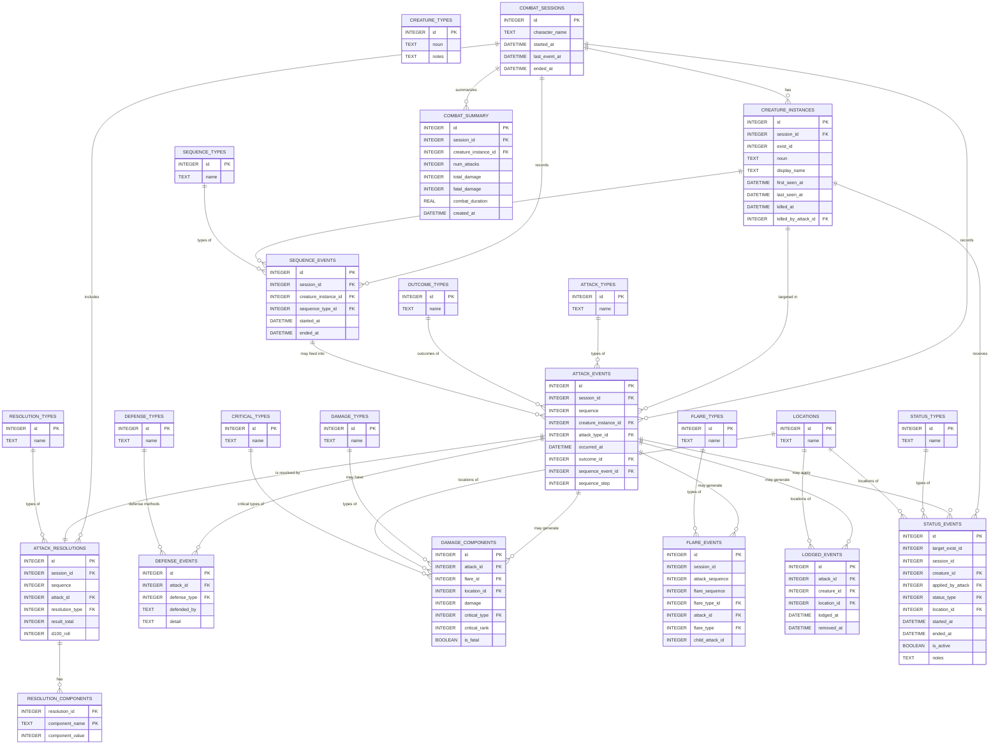

```mermaid
erDiagram
    %% Lookup tables
    CREATURE_TYPES {
      INTEGER id PK
      TEXT    noun
      TEXT    notes
    }
    ATTACK_TYPES {
      INTEGER id PK
      TEXT    name
    }
    RESOLUTION_TYPES {
      INTEGER id PK
      TEXT    name
    }
    DAMAGE_TYPES {
      INTEGER id PK
      TEXT    name
    }
    FLARE_TYPES {
      INTEGER id PK
      TEXT    name
    }
    STATUS_TYPES {
      INTEGER id PK
      TEXT    name
    }
    LOCATIONS {
      INTEGER id PK
      TEXT    name
    }
    CRITICAL_TYPES {
      INTEGER id PK
      TEXT    name
    }
    OUTCOME_TYPES {
      INTEGER id PK
      TEXT    name
    }
    DEFENSE_TYPES {
      INTEGER id PK
      TEXT    name
    }
    SEQUENCE_TYPES {
      INTEGER id PK
      TEXT    name
    }

    %% Fact / event tables
    COMBAT_SESSIONS {
      INTEGER   id PK
      TEXT      character_name
      DATETIME  started_at
      DATETIME  last_event_at
      DATETIME  ended_at
    }
    CREATURE_INSTANCES {
      INTEGER   id PK
      INTEGER   session_id FK
      INTEGER   exist_id
      TEXT      noun
      TEXT      display_name
      DATETIME  first_seen_at
      DATETIME  last_seen_at
      DATETIME  killed_at
      INTEGER   killed_by_attack_id FK
    }
    ATTACK_EVENTS {
      INTEGER   id PK
      INTEGER   session_id FK
      INTEGER   sequence
      INTEGER   creature_instance_id FK
      INTEGER   attack_type_id FK
      DATETIME  occurred_at
      INTEGER   outcome_id FK
      INTEGER   sequence_event_id FK
      INTEGER   sequence_step
    }
    ATTACK_RESOLUTIONS {
      INTEGER   id PK
      INTEGER   session_id FK
      INTEGER   sequence
      INTEGER   attack_id FK
      INTEGER   resolution_type FK
      INTEGER   result_total
      INTEGER   d100_roll
    }
    RESOLUTION_COMPONENTS {
      INTEGER   resolution_id FK
      TEXT      component_name PK
      INTEGER   component_value
    }
    DEFENSE_EVENTS {
      INTEGER   id PK
      INTEGER   attack_id FK
      INTEGER   defense_type FK
      TEXT      defended_by
      TEXT      detail
    }
    DAMAGE_COMPONENTS {
      INTEGER   id PK
      INTEGER   attack_id FK
      INTEGER   flare_id FK
      INTEGER   location_id FK
      INTEGER   damage
      INTEGER   critical_type FK
      INTEGER   critical_rank
      BOOLEAN   is_fatal
    }
    FLARE_EVENTS {
      INTEGER   id PK
      INTEGER   session_id
      INTEGER   attack_sequence
      INTEGER   flare_sequence
      INTEGER   flare_type_id FK
      INTEGER   attack_id FK
      INTEGER   flare_type FK
      INTEGER   child_attack_id
    }
    LODGED_EVENTS {
      INTEGER   id PK
      INTEGER   attack_id FK
      INTEGER   creature_id FK
      INTEGER   location_id FK
      DATETIME  lodged_at
      DATETIME  removed_at
    }
    STATUS_EVENTS {
      INTEGER   id PK
      INTEGER   target_exist_id
      INTEGER   session_id
      INTEGER   creature_id FK
      INTEGER   applied_by_attack FK
      INTEGER   status_type FK
      INTEGER   location_id FK
      DATETIME  started_at
      DATETIME  ended_at
      BOOLEAN   is_active
      TEXT      notes
    }
    SEQUENCE_EVENTS {
      INTEGER   id PK
      INTEGER   session_id FK
      INTEGER   creature_instance_id FK
      INTEGER   sequence_type_id FK
      DATETIME  started_at
      DATETIME  ended_at
    }
    COMBAT_SUMMARY {
      INTEGER   id PK
      INTEGER   session_id FK
      INTEGER   creature_instance_id FK
      INTEGER   num_attacks
      INTEGER   total_damage
      INTEGER   fatal_damage
      REAL      combat_duration
      DATETIME  created_at
    }

    %% Relationships
    COMBAT_SESSIONS ||--o{ CREATURE_INSTANCES      : "has"
    COMBAT_SESSIONS ||--o{ ATTACK_EVENTS           : "records"
    COMBAT_SESSIONS ||--o{ ATTACK_RESOLUTIONS      : "includes"
    COMBAT_SESSIONS ||--o{ SEQUENCE_EVENTS         : "records"
    COMBAT_SESSIONS ||--o{ COMBAT_SUMMARY          : "summarizes"

    CREATURE_INSTANCES ||--o{ ATTACK_EVENTS         : "targeted in"
    CREATURE_INSTANCES ||--o{ SEQUENCE_EVENTS       : "participates in"
    CREATURE_INSTANCES ||--o{ STATUS_EVENTS         : "receives"

    ATTACK_EVENTS ||--|| ATTACK_RESOLUTIONS      : "is resolved by"
    ATTACK_EVENTS ||--o{ DEFENSE_EVENTS         : "may have"
    ATTACK_EVENTS ||--o{ DAMAGE_COMPONENTS      : "may generate"
    ATTACK_EVENTS ||--o{ FLARE_EVENTS           : "may generate"
    ATTACK_EVENTS ||--o{ LODGED_EVENTS          : "may generate"
    ATTACK_EVENTS ||--o{ STATUS_EVENTS          : "may apply"

    ATTACK_RESOLUTIONS ||--o{ RESOLUTION_COMPONENTS: "has"

    SEQUENCE_TYPES ||--o{ SEQUENCE_EVENTS        : "types of"
    ATTACK_TYPES   ||--o{ ATTACK_EVENTS          : "types of"
    RESOLUTION_TYPES ||--o{ ATTACK_RESOLUTIONS    : "types of"
    DAMAGE_TYPES   ||--o{ DAMAGE_COMPONENTS      : "types of"
    FLARE_TYPES    ||--o{ FLARE_EVENTS           : "types of"
    STATUS_TYPES   ||--o{ STATUS_EVENTS          : "types of"
    LOCATIONS      ||--o{ LODGED_EVENTS          : "locations of"
    LOCATIONS      ||--o{ DAMAGE_COMPONENTS      : "locations of"
    LOCATIONS      ||--o{ STATUS_EVENTS          : "locations of"
    CRITICAL_TYPES ||--o{ DAMAGE_COMPONENTS      : "critical types of"
    OUTCOME_TYPES  ||--o{ ATTACK_EVENTS          : "outcomes of"
    DEFENSE_TYPES  ||--o{ DEFENSE_EVENTS         : "defense methods"

    %% (Optional) link sequence_event_id back into ATTACK_EVENTS
    SEQUENCE_EVENTS ||--o{ ATTACK_EVENTS         : "may feed into"
```